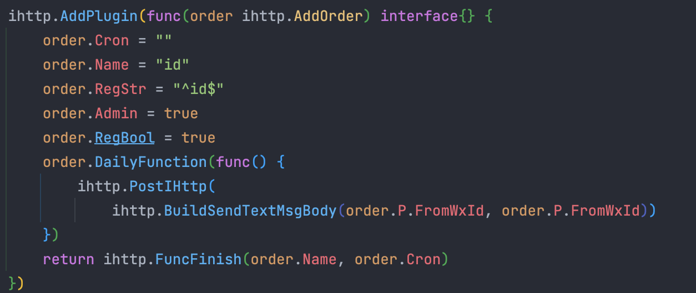

# 
 Miao_Bot

一个想用go来玩插件bot的辣鸡选手 
这个文件夹gin-vue-admin-main是以后bot的前端框架，我还没想好咋写。 
前端基于[gin-vue-admin](https://github.com/flipped-aurora/gin-vue-admin)  想部署前端的点击link部署即可。

- ### 目前已实现的功能： 
  - [x] 用go微信机器人http交互  
    - [x] 对话式交流 
    - [x] 指定任务开关  
    - [x] 正则判断，是否管理员，判断条件，以最快速编写的一个小go插件脚本。 

- ### 未来实现的功能：（计划周期：**~~半年完成~~**） 
    - [ ] 对接telegram的client和bot 
    - [ ]  对接qq 
    - [ ]  微信与ginvueadmin前端交接 
    - [ ] 还有goja编写js 

### 微信机器人交互如下图所示👇🏻：  

 
 

### 编写go插件如图👇🏻：  

 
 

### 一起学习合作交流加👇🏻 

#### 微信wechat: a1140601003 

#### 电报tg：@Hss114060

### 请我喝奶茶呗🧋 

