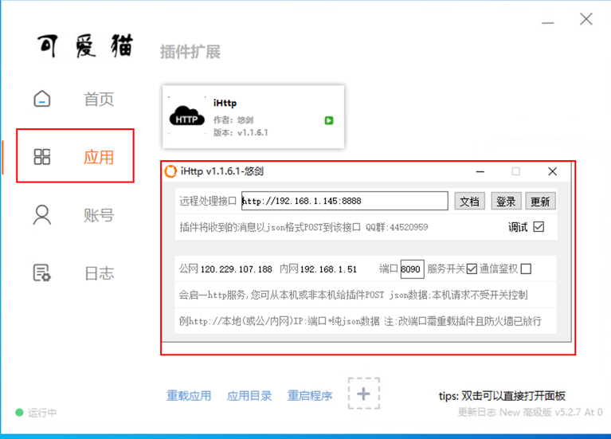
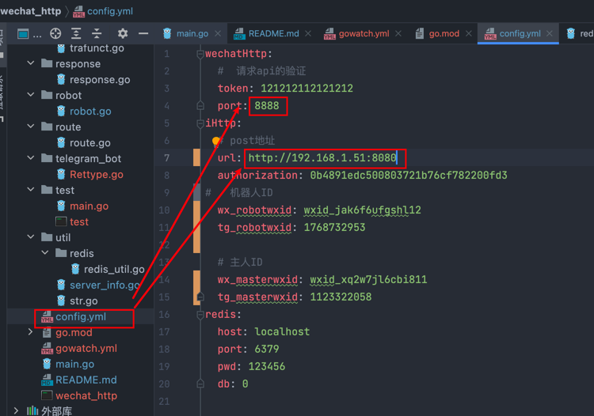
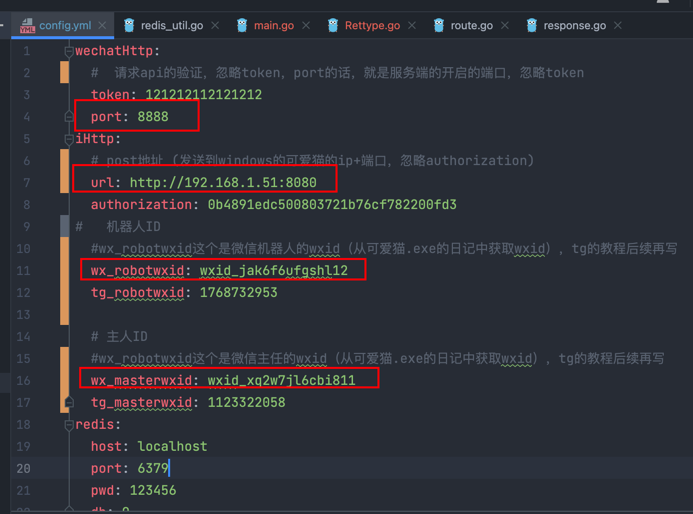

# 
 Miao_Bot

## 简介

因为本人某些业务需要用到微信机器人，刚刚好花了几个月学了点golang，在加上[可爱猫ihttp插件](https://blog.vwzx.com/keaimao-http-sdk)的作者伟大贡献，于是一切都应运而生.

这个文件夹gin-vue-admin-main是以后bot的前端框架，我还没想好咋写（忽略我菜鸡）。 
前端基于[gin-vue-admin](https://github.com/flipped-aurora/gin-vue-admin)  想部署前端的点击link部署即可。

- ### 目前已实现的功能： 
    - [x] 用go编写微信机器人与可爱猫ihttp交互  
        - [x] 对话式交流 
        - [x] 指定插件开关  
        - [x] 正则判断，是否管理员，判断条件(以最快速编写go插件脚本) 
        - [x] 对接telegram的client和bot 

- ### 未来实现的功能：（计划周期：**~~半年完成~~**） 
    - [ ]  对接qq 
    - [ ]  ginvueadmin前端交接 
    - [ ]  goja编写js 

### 微信机器人交互如下图所示👇🏻：  

 
 

### 编写go插件如图👇🏻：  

 
 

## 如何使用和部署机器人👇🏻：

### 第一步：可爱猫配置

**背景：假设服务端为ip：192.168.1.145，启动端口：8888**

1. 解压本文件夹里面的**可爱猫5.2.7.zip**

- 点击对应微信版本安装包进行安装。

2. 双击可爱猫.exe，点击应用，双击插件，如下图
      
3. 下面进行配置远程处理端口[可以理解为：整个go程序开启的端口(服务端)]👇🏻：
   

- 可以看到插件配置的远程端口和我们**config.yaml里面的插件ihttp的url**一一对应的

### 第二步：服务端config.yaml配置

1. 根据config.yaml的注释进行配置。
   

## 第三步：测试机器人

1. 发送"**鸡你太美**"给机器人。
2. 如果机器人给你反应就部署成功了。

### 一起学习合作交流加👇🏻 

#### 微信wechat: a1140601003 

#### 电报tg：@Hss114060

### 请我喝奶茶呗🧋 

